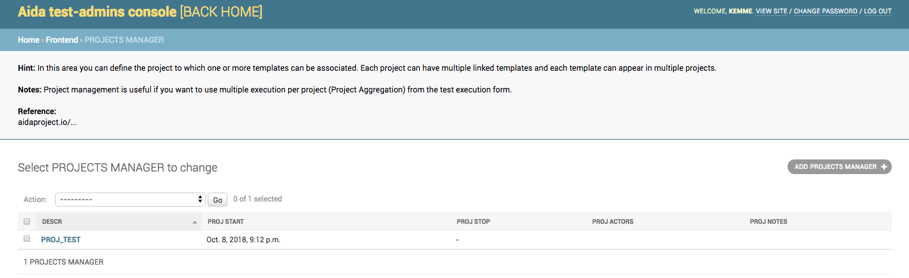
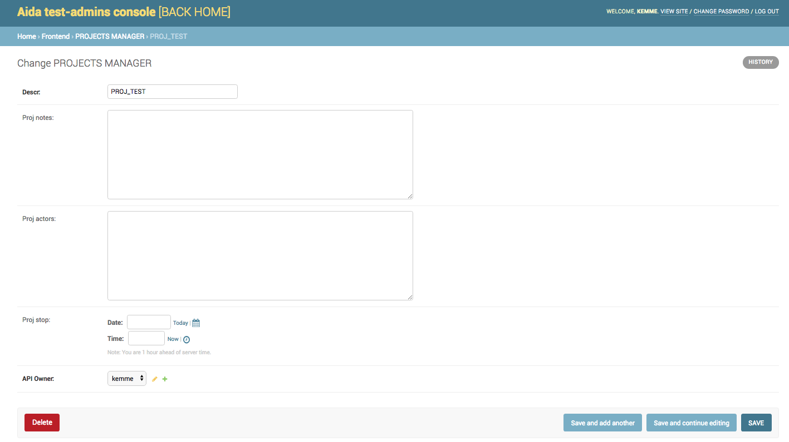

Advanced Usage
==============

Integration with Jira
-----------------

The aida suite integrates the ability to send the results of every single test finished to Jira, specifying the number of Issues to which you want to refer.
To perform this operation it is sufficient to select the desired thread from the "History" mask, then every single execution (if the test has been performed repeatedly), if the Jira configuration has been set, it will be possible to connect the data between the two systems.

.. figure:: img/jira_list.png
   :scale: 50 %
   :alt: Aida test keywords
   
To ensure that the ability to send data to Jira is activated, it is necessary to specify the connection parameters to your Jira server from the "Template Manager" by selecting the "JIRA SETTINGS" option.

The Project Template link
-----------------

Through the use of the Project Template link it is possible to group templates in specific projects in order to be able to execute several templates simultaneously by selecting the relative project.

To manage the Templates / Projects association, select the "PROJECT TEMPLATE LINK" link in the Template Manager

   
   
To associate an existing Template with a project it is necessary to use the selection areas from the add / modify mask.
If no project is present or if it is necessary to create a new one, it is sufficient to use the "**+**" button next to the "Proj ID" area

   
   

Project Manager
-----------------

Through the use of the "Projrct Manager" function it is possible to create projects containers, associating management parameters with them.
To create a new project, select the "**PROJECTS MANAGER**" menu from the Template Manager.

 
 
Using the function of adding or modifying a project, the fields of the mask will be displayed.
Through this page it will be possible, besides giving the project name, to add any notes, add actors to the project and define a date and a closing time of the project itself.

.. note::
   The project will be visible and usable to perform the tests contained until the stop date. Once finished, it will no longer be possible to select this project to run the tests contained in it.

TAG Manager
-----------------

The TAGS Templates Link
-----------------

Test Group Item
-----------------

Test Group Manager
-----------------
