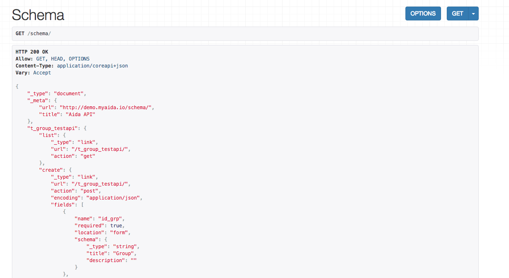
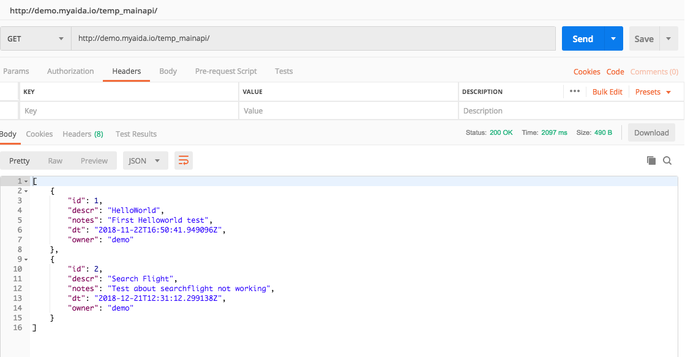

API Documentation
==============

Aida integrates the ability to interact with its database through API interface.
Using methods calls like GET, POST, DELETE, PUT, it is possible to interface with external programs or to perform extractions, insertions, table updates directly from code.

Using the link in the main menu "**Schema API**" it will be possible to display the page relative to the published schema of the aida tables, the manageable fields and their type and methods.

   
.. warning::
  **Methods such as INSERT, DELETE, PUT make table changes without requiring confirmation.**
  The use of this type of interaction should only be used in cases where it is absolutely safe not to cause damage to the entire system, incorrect use could lead to the impossibility of using aida with the consequent risk of irreversible data loss.
  
  Here an example of a GET call from a GUI tools (postman) to the template description table
  

   

.. code-block:: python
   
   def test():
      print('Ciao')

