Using Aida as a Test Suite
===========================

Aida is a test suite based on robotframework and selenium that allows you to perform almost any type of test on any environment you want.
To test with Aida you must first create a template that can then be run by different users and with different values from the Aida testing engine.

Once logged in to the system, to go to configure a test you need to use the **Templates Manager** link from the main menu:

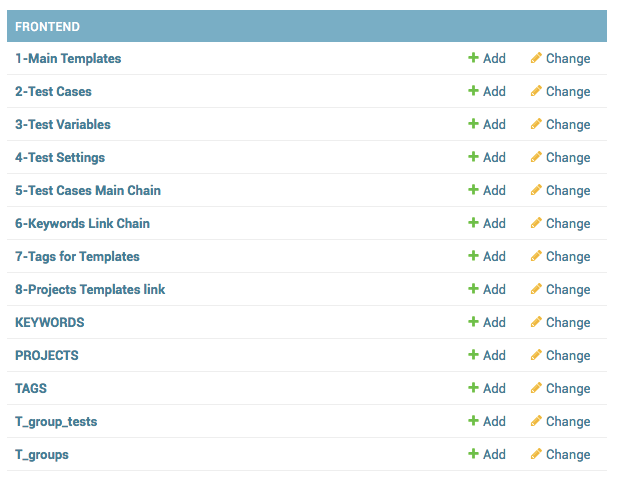

1-Main Templates
-----------------

Once you have selected the step to be created for creating the template, you will be presented with the form containing the list of data present in that session, simply go to select the **ADD ..** button to add a new record or select a value existing to be able to manage it.

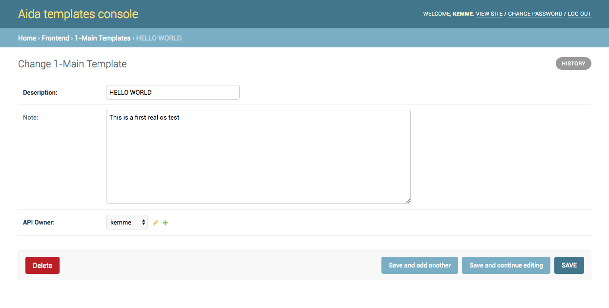

* **Description**: Template name that is being created
* **Note**: Additional information regarding the template you are going to create

.. warning::
   * **API Owner**: User to the interaction rights will be assigned through API to the specific table. Only the selected user can manage API calls to that specific data

2-Test Cases
-----------------

The page dedicated to the creation / modification of the tet cases allows authirized users to create and associate all the test cases that you want to include to a main template.

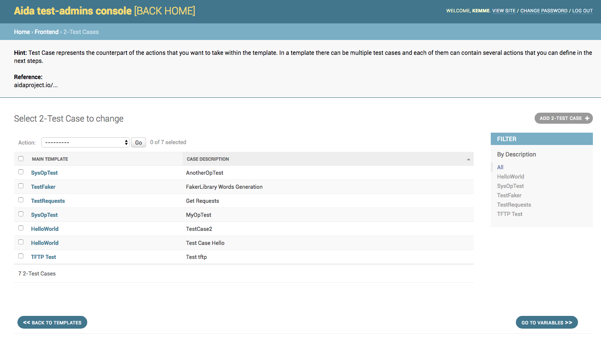

By selecting an existing test case it's possible to modify the data (Template id, description of the test case and API owner), while using the "**ADD 2-TEST CASE**" button it will be possible to insert a new test case.

3-Test Variables
-----------------

The variable management mask allows to associate to the main template key / value associations that can be managed by the main test execution mask by the tester in charge

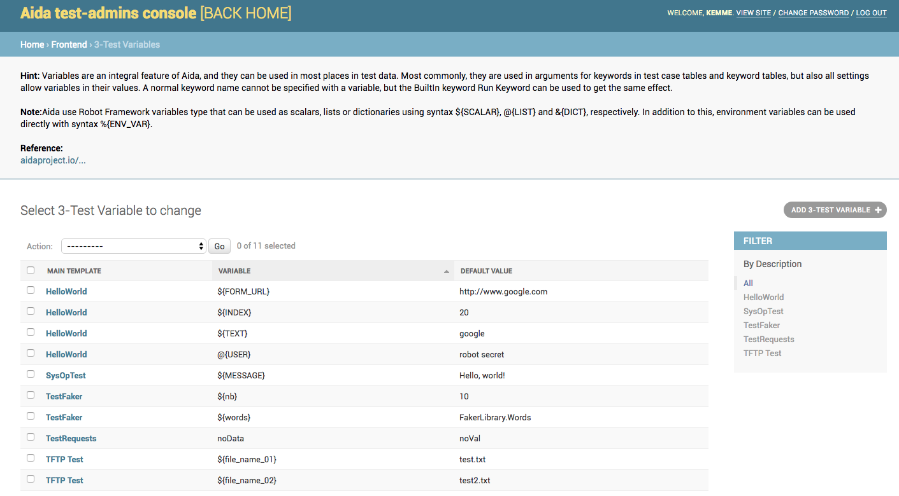

.. note::
   These settings influence the display of the frontend side template and manage the possibility of inserting and modifying the values in execution of the test.
If you need to insert data that can not be modified during the test execution phase, these should not be inserted in this form.

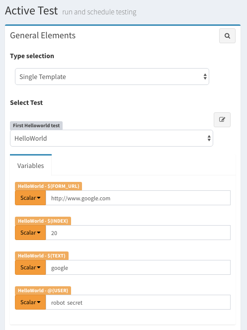

The template for managing / inserting the variables provides for selecting the main template to which the data is to be linked, the name of the variable and any value (it is also possible to leave it null)

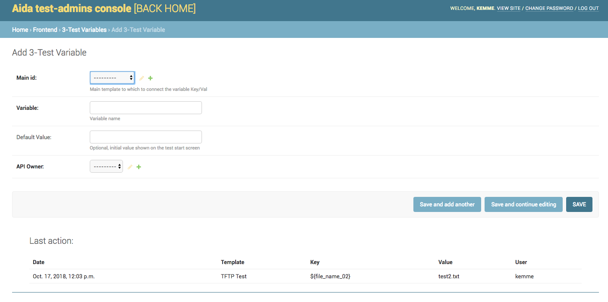

4-Test Settings
-----------------

The settings management mask allows to associate to the main template almost all types of manageable libraries (Library, Documentation, Test Setup, Test Teardown, Suite Setup, Suite teardown, etc.)

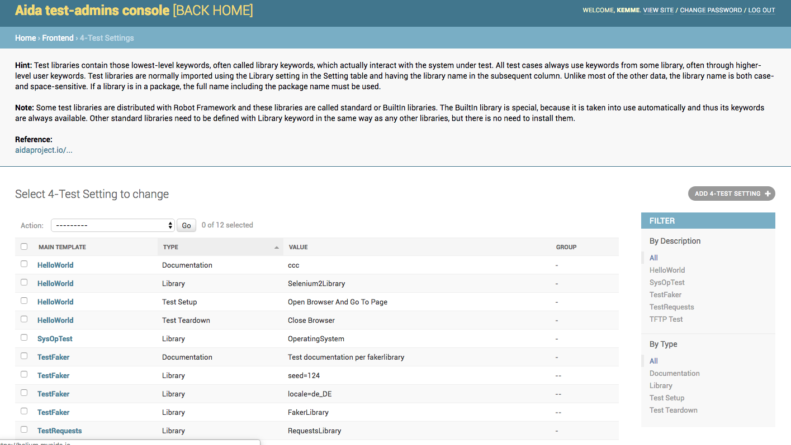
 
.. warning::
   When associating new libraries with your template make sure to enter the correct value in the "Value" field once Type **Lybrary** is specified.
   The add / edit mask shows at the bottom the list of libraries currently available for your work environment.
   An incorrect association of the value of a library can lead to errors in the execution of the test.
   
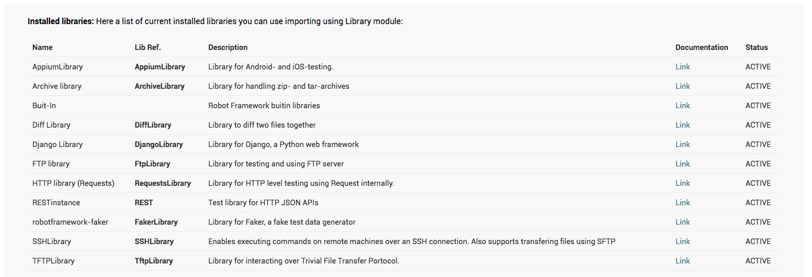

To add a new library just go to select the button on the upper right "**ADD 4-TEST SETTING**" and fill in the form with the data relative to the name of the main template, type and value of the library and eventual grouping of values if necessary

   
.. note::
   The grouping function allows you to **aggregate multiple values to a single type of data**. If, for example, you want to create a Library-like setting with both "RequestsLibrary" and "Collections" values, simply add the line twice in the settings to indicate the same group.
   
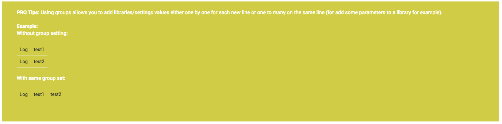

5-Test Cases Main Chain
-----------------

In this area it's possible to connect test cases, variables and related values to each other. Unlike the Test Variables area, in this case the name / value association for the variable remains **inside** the template and is executed during the run of the test without being able to be modified by the tester at frontend.

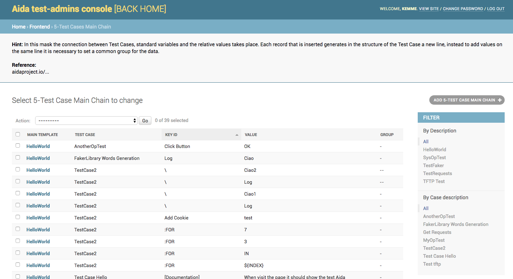

.. note::
   In this form it is possible to implement also for loops using the key ded: FOR as follows:
   
   .. figure:: img/for_set.png
   
   The result is a directive within the testcase that will be executed at each test run.
   
   .. figure:: img/for_black.png

It is possible to add a new association or modify an existing one simply by setting the parameters related to main template, associated test case, key / value and eventual grouping in add or edit mask.

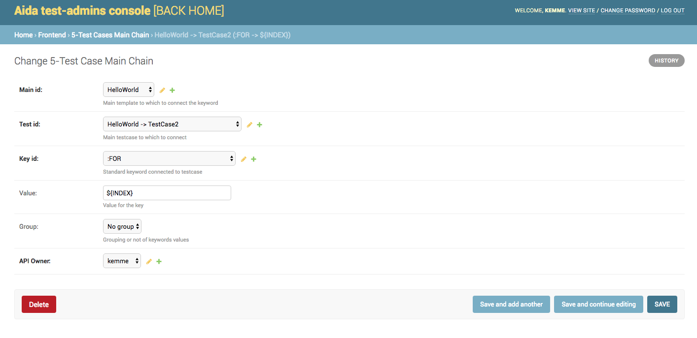

6-Keywords Link Chain
-----------------
