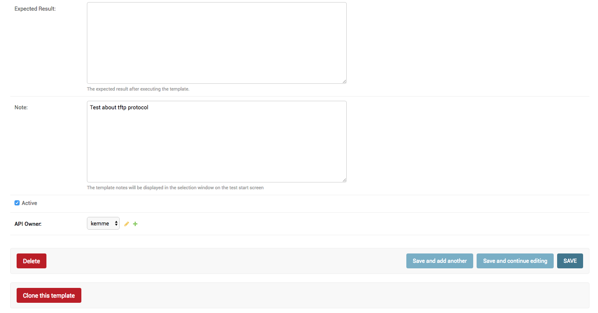

Using Aida as a Test Suite
===========================

Aida is a test suite based on robotframework and selenium that allows you to perform almost any type of test on any environment you want.
To test with Aida you must first create a template that can then be run by different users and with different values from the Aida testing engine.

Once logged in to the system, to go to configure a test you need to use the ** Templates Manager ** link from the main menu:

.. figure:: img/template_main.png
   :scale: 50 %
   :alt: Aida login page

1-Main Templates
-----------------

Once you have selected the step to be created for creating the template, you will be presented with the form containing the list of data present in that session, simply go to select the **ADD ..** button to add a new record or select a value existing to be able to manage it.

.. figure:: img/template1.png
   :scale: 50 %
   :alt: Aida login page

* **Description**: Template name that is being created
* **Note**: Additional information regarding the template you are going to create

.. warning::
   * **API Owner**: User to the interaction rights will be assigned through API to the specific table. Only the selected user can manage API calls to that specific data

2-Test Cases
-----------------

3-Test Variables
-----------------

4-Test Settings
-----------------

5-Test Cases Main Chain
-----------------

6-Keywords Link Chain
-----------------
