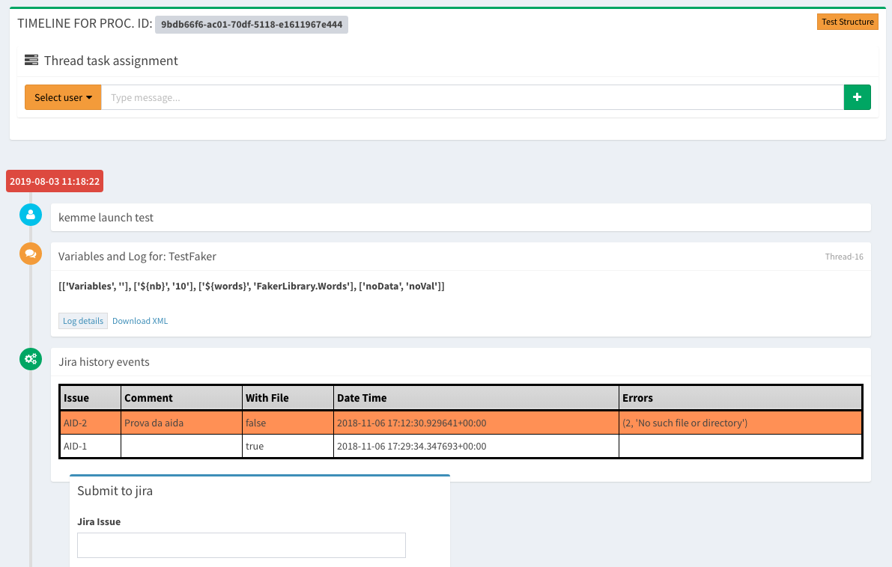

Manage Aida frontend
==================  

Active 
-----------------

From the active processes management window it is possible to execute, monitor and manage the created templates and the public variables associated to them.

.. figure:: img/active.png
   :scale: 50 %
   :alt: Aida test keywords

The window consists of the following main areas:

**General elements**

  In this area it is possible to make the type of selection with regard to the tests to be performed, the possible choices are:
  -Single Template
  -Test Group
  -TAG Aggregation
  -Project Aggregation
  
  Once selected the Test Type choice the test are will automatically filled according to the choice made in the preview section.
  Once an item has been selected, the description entered during the configuration phase will appear above the selection.
  
  The Variables session appears as soon as the selection of the test / group to be launched is carried out and contains all those data/value keys defined in the design phase of the template in the "Test Variables" area.
  
  .. note::
   For each variable at the frontend it is possible to use three different types of data management:
   
   **Scalar**: The value of the associated variable remains that for each test run
   
   **Random (Num)**: By inserting a range of numerical values in the format "<Minimum number> - <Maximum number>" each time the test is   performed, the system will enter a random numerical value contained within the specified intervals.
   
   **Random (String)**: By entering the number of characters of which the string should be composed, the system automatically at each run cycle will insert a random string with the number of characters defined in the test

  At the base of the section it is possible to go and schedule the repetitiveness of the execution; this can be set to:
  
  **Once**: The test is performed only once
  
  **Every Minutes**: specifying the value of the minutes of waiting between one execution and another the test is performed until the manual stop by the user every n minutes defined.
  
  **Every hour**: No input value requested by the user; The test is performed until the user stops every hour starting from the first execution.
  
  **Every Day**: By entering the time in the format HH: MM the test is repeated until the manual syop by the user at the same time every day.
   
  .. figure:: img/active_general.png

**System Load Chart**

The system load management graph monitors the situation related to the activity on the central system in relation to the load of the your dedicated test engine.

.. figure:: img/active_load.png
   :scale: 50 %
   :alt: Aida test keywords

**Preview**

The preview area allows you to view, once the template to be executed is selected, a representation of the test structure that will be created dynamically created by the template settings.

History
-----------------

The management of the history in aida includes all the completed tests.
From the summary table you can go to view all the information about the tests performed and their subchilds (in case of multiple executions).
Selecting a column name automatically the whole table will be sorted by this value, first click ascending order, second one descending order. To return to original table view, simply order by ID (first column)

  
  
Selecting a line you will be able to see the details of the whole process.

   
.. note::
   From the history process selection detail it is possible to assign a ticket to another user relative to the test run that is being selected. To do this it is sufficient to select from the orange drop-down menu the name of the user for which the ticket have to be assigned, the explanatory text and, selecting the + button, the note will be entered and assigned to the selected user.
If an email address was entered during the creation of the user, the system will send an email notification.

From this position it will be possible to view the HTML representation of the test performed using the "**Test Structure**" button, the log file of each execution using the "**Log details**" button, download the XML format for each run using  "**Download XML**" link and the details of the variables and their values used during the test execution; In case the integration with Jira is active, it will be possible to send directly to a Jira Issue, the detail of test execution and the relative log created.
   

Libraries
-----------------

Currently aida has implemented several libraries to implement test templates on practically most of the software / firmware aspects that can be tested.
The aida's built-in libraries allow to perform tests on different aspects such as:

   - Web applications
   - Mobile applications
   - Different types of files
   - FTP server
   - HTTP Requests
   - REST APIs
   - SFTP applications
   - TFTP services
   - Third-party framework like Django
   - Any GUI component

... and so on

The libraries currently installed in aida are:

.. figure:: img/lib_list.png
   :scale: 50 %
   :alt: Aida libraries

**It is possible to load custom libraries** to be used inside your templates using the "**Libraries**" link in the lateral management menu or in the "**Template Manager**" through the "ADD" function next to "LIBRARIES"

.. note::
   Currently only libraries written in python and packaged according to the python standard (https://packaging.python.org/tutorials/packaging-projects/) are accepted.
   The loaded libraries will remain in the PENDING state until they are approved by the aida control staff.
   Once approved, they can be incorporated into the templates.
   
   
Keywords
-----------------

Keyswords are the basic concept of how aida works.
The logic of creation and functionality of the templates is based on the concept of keywords driven execution.

Keywords within the aida system can be created and managed in two ways, as **Personal keys** and **Non-personal keys**.
Basically the non-personal keys are intended as the built-in keys of standard libraries (all the keys of robotframework for example) while the personal keys are those inserted / created by the user.
The big difference between these two types of keys is that the personal keys can be connected as sub keys to non-personal ones, but not the opposite.

.. warning::
   This kind of behavior particularly affects the key / value association phase (See the topic "Keywords Link chain" https://aidadoc.readthedocs.io/en/latest/firstuse.html#keywords-link-chain)
   
To manage / add keys to aida it is sufficient to use the "Keywords" link in the main menu or through the "Template Manager"

   
To add or manage a keyword it is sufficient to select it or use the "ADD KEYWORD" button

   
By default the new keys are proposed as "Personal", to change this setting is sufficient to flag the "**Personal keyword**" option

.. note::
   It is possible to show the keyword in a "human" connotation at the moment of the selection for the creation of template simply modifying the description in the Human field.
  

   
Aida Assist
-----------------

Aida Assist is the innovative interface of the aida project that allows you to import ad-hoc test templates from a Cathedral's owner artificial intelligence engine that, by analyzing the use of the suite learns always with more precision what the habits about the user's Test Strategies and creates templates ready to import and use / modify within your suite.

   
Using the magnifying glass located above each frame, you can go to see the template structure:

   
To directly import one or more templates into your environment it is sufficient to select the template and click on the "IMPORT THIS TEMPLATE" button.
At this point the template and all its configuration will be present among your data, you can launch tests directly or go to change it as you see fit.
