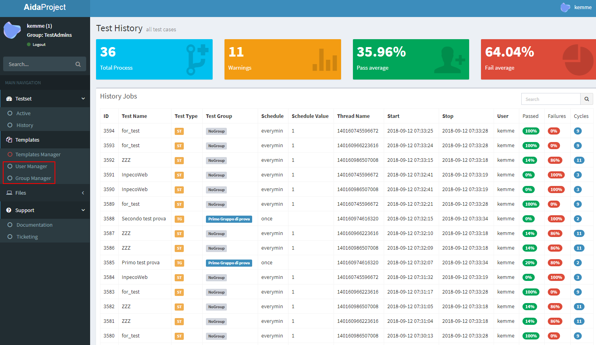
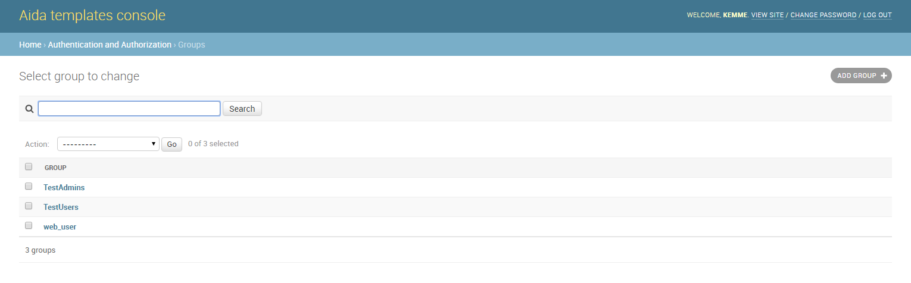
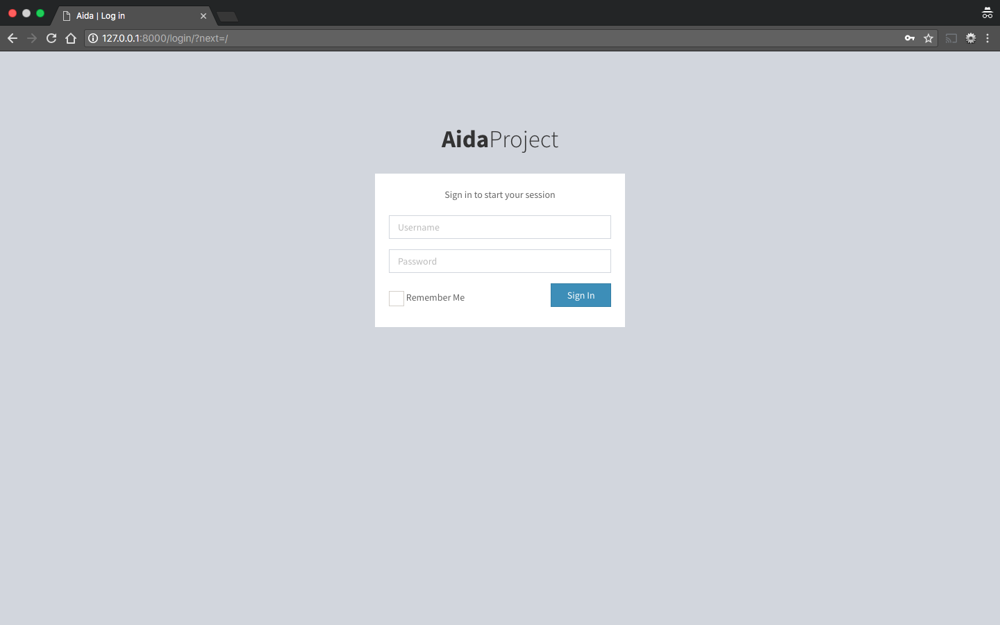

.. AidaDocs documentation master file, created by
   sphinx-quickstart on Mon Sep 10 11:12:51 2018.
   You can adapt this file completely to your liking, but it should at least
   contain the root `toctree` directive.

Welcome to Aida's documentation!
====================================

.. toctree::
   :maxdepth: 2
   :caption: Contents:

   what-label
   strings
   datatypes
   numeric

.. _about-label:

Something About Aida
==============

Aida ATM (Automation Test Suite) allows you to create, manage, plan and perform independently any type of test on any type of software / firmware.. A vital feature for every business in every industrial sector.

Aida offers a native integration with roboframework and selenium, it uses a fast and intuitive graphic interface for the creation of its test templates and allows the importation of any existing .robot files inside the suite.
In addition, the "Standalone" version allows you to write and import custom test libraries into Aida and integrate them automatically with the entire process.

The main advantages of using Aida are:

- Management of the Testset as template; possibility of multiple launches contemporary with different variables
- Quick and intuitive template writing
- Integration with every type of python library
- Reporting and analysis in real time
- Integration with AI algorithms for anticipated prediction of the tests results

.. highlight:: py

.. _what-label:

-------------------
What is Aida
-------------------
Aida is a Functional testing tool which is best suited not just for regression testing of the applications. Aida is free in web version and does not have hardware or software specification limits which is one of the most popular tools available in the market. It compares the actual and expected result and reports the results in the execution summary :code:`TEST'.

--------------
Contents
--------------

* :ref:`about-label`
* :ref:`what-label`
* :ref:`start-label`
* :ref:`user-label`
* :ref:`using-label`
   * :ref:`using1-label`
   * :ref:`using2-label`
   * :ref:`using3-label`
* :ref:`templates-label`
* :ref:`advanced-label`
* :ref:`support-label`
   * :ref:`support1-label`
* :ref:`involved-label`

.. _start-label:

Start with Aida
==============

Aida was prouded developed by:

and bla bla

-----------------
Subscription plans
-----------------

.. _user-label:

Create user and manage groups
==============

----------------
Create and manage groups
-----------------

In Aida, the group is a grouping of actions that the user associated with that group can perform within the system.
Basically the types of action that can be associated with a group are:

* :bold:'View'
* :bold:'Add/Edit'
* :bold:'Delete'

To define and manage groups in Aida, it is sufficient to use the Templates-> Group Manager menu

Once you have access to group management from the main menu, the administration screen will show the list of active groups in the system:
   

Create a new group
-----------------

To create a new group of users is sufficient, from the group management screen just opened select the "ADD GROUP" button, the mask to add a new group will appear:

.. figure:: img/group_new.png
   :scale: 50 %
   :alt: Aida groups

* :bold:'Name' :Name that you want give to the new group (unique)
* :bold:'Available permissions' :Permissions that can be provided or denied on the various system tables
* :bold:'Chosen permission' :Permits that have been assigned to the group we are creating

.. note::
   Within all Aida administration forms, there are three buttons to confirm the changes you want to make:

   * :bold:'Save and add another' :It saves the data entered, and proposes the same cleaned mask in order to quickly perform a new data    entry. (in some masks, once this option is selected, the system will re-propose some pre-filled fields to guarantee insertion speed)
   * :bold:'Save and continue editing' :Save the entered data and re-propose the mask with the same data inside the various fields present before the saving
   * :bold:'SAVE' :Save the entered data and return to the list of options previous to the current mask.

-----------------
Create and manage user
-----------------

.. _using-label:

Using Aida Test Suite
==============

For start using Aida you have to register a new demo account on aida website `registration page <http://aidaproject.io/>`_.
Once the configuration is ready you'll receive at the registration email address personal link and username/password data for access into the login screen:

.. _using1-label:

History
-----------------

.. _using2-label:

Testset
-----------------

.. _using3-label:

Files
-----------------

.. _templates-label:

Create and Manage Templates
==================

.. _advanced-label:

Advanced Usage
==============

.. _support-label:

Support
==============

.. _support1-label:

Ticketing system
-----------------

.. _involved-label:

Get Involved!
==============
