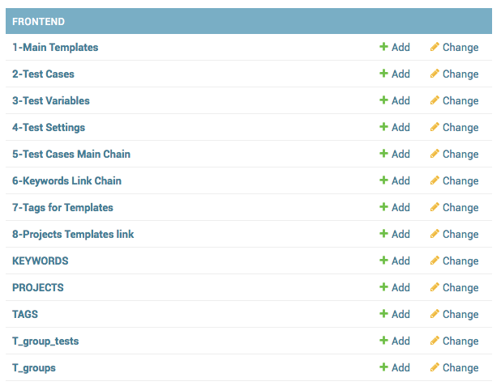
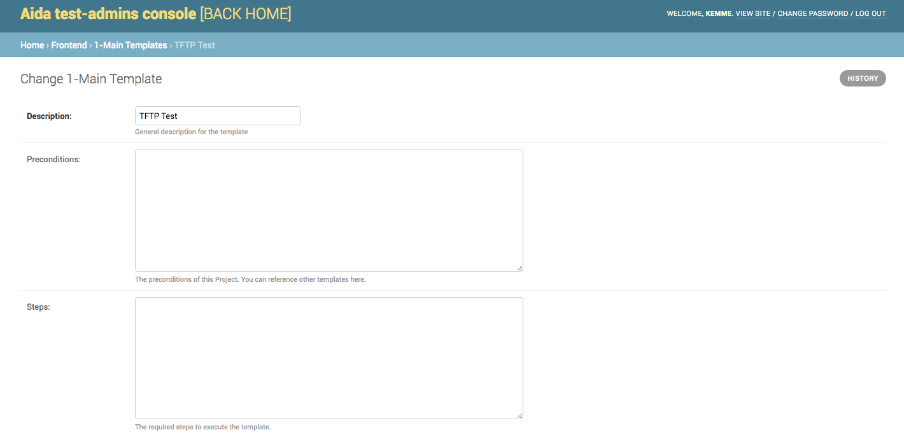

.. AidaDocs documentation master file, created by
   sphinx-quickstart on Mon Sep 10 11:12:51 2018.
   You can adapt this file completely to your liking, but it should at least
   contain the root `toctree` directive.
   
Welcome to Aida's documentation!
====================================

.. toctree::
   :maxdepth: 2
   :caption: Contents:

   what-label
   strings
   datatypes
   numeric

.. _about-label:

Something About Aida
==============

Aida ATM (Automation Test Suite) allows you to create, manage, plan and perform independently any type of test on any type of software / firmware.. A vital feature for every business in every industrial sector.

Aida offers a native integration with roboframework and selenium, it uses a fast and intuitive graphic interface for the creation of its test templates and allows the importation of any existing .robot files inside the suite.
In addition, the "Standalone" version allows you to write and import custom test libraries into Aida and integrate them automatically with the entire process.

The main advantages of using Aida are:

- Management of the Testset as template; possibility of multiple launches contemporary with different variables
- Quick and intuitive template writing
- Integration with every type of python library
- Reporting and analysis in real time
- Integration with AI algorithms for anticipated prediction of the tests results

.. highlight:: py

.. _what-label:

-------------------
What is Aida
-------------------
Aida is a Functional testing tool which is best suited not just for regression testing of the applications. Aida is free in web version and does not have hardware or software specification limits which is one of the most popular tools available in the market. It compares the actual and expected result and reports the results in the execution summary :code:`TEST'.

--------------
Contents
--------------

* :ref:`about-label`
* :ref:`what-label`
* :ref:`start-label`
* :ref:`user-label`
* :ref:`using-label`
   * :ref:`using1-label`
   * :ref:`using2-label`
   * :ref:`using3-label`
* :ref:`templates-label`
* :ref:`advanced-label`
* :ref:`support-label`
   * :ref:`support1-label`
* :ref:`involved-label`

.. _start-label:

Start with Aida
==============

Aida was prouded developed by:

.. figure:: img/logo.png
   :target: http://cathedral.ai
   :scale: 30 %
   :alt: Cathedral.ai logo

and bla bla

-----------------
Subscription plans
-----------------

.. _user-label:

Create user and manage groups
==============

----------------
Create and manage groups
-----------------

In Aida, the group is a grouping of actions that the user associated with that group can perform within the system.
Basically the types of action that can be associated with a group are:

* **View**
* **Add/Edit**
* **Delete**

To define and manage groups in Aida, it is sufficient to use the **Users and Groups-> Group Manager** menu

Once you have access to group management from the main menu, the administration screen will show the list of active groups in the system:
   
.. figure:: img/group_home.png
   :scale: 50 %
   :alt: Aida groups

Create a new group
-----------------

To create a new group of users is sufficient, from the group management screen just opened select the "ADD GROUP" button, the mask to add a new group will appear:

.. figure:: img/group_add.png
   :scale: 50 %
   :alt: Aida groups

* **Name** :Name that you want give to the new group (unique)
* **Available permissions** :Permissions that can be provided or denied on the various system tables
* **Chosen permission** :Permits that have been assigned to the group we are creating

.. note::
   Within all Aida administration forms, there are three buttons to confirm the changes you want to make:

   * **Save and add another** :It saves the data entered, and proposes the same cleaned mask in order to quickly perform a new data    entry. (in some masks, once this option is selected, the system will re-propose some pre-filled fields to guarantee insertion speed)
   * **Save and continue editing** :Save the entered data and re-propose the mask with the same data inside the various fields present before the saving
   * **SAVE** :Save the entered data and return to the list of options previous to the current mask.

Manage an existing group
-----------------

To go to manage an existing group, and sufficient, from the main group management page, select the group on which you intend to work, the following screen will appear:

   
The mask is similar to that for adding a new group seen before, with the difference that in the **Chosen permissions** section there are the previously assigned permissions.

.. note::
   In all the editing templates of Aida there is the possibility to see the history of the changes made on the data that are being managed through the use of the ** HISTORY ** button located at the top right.

-----------------
Create and manage user
-----------------

Once the aida group (s) have been defined, it is possible to create one or more users to associate with that group through the **User Management** function from the Aida homescreen.

Create a new user
-----------------

To create a new user in Aida, from the main user management mask, select the ** ADD USER + ** button

.. figure:: img/user_home.png
   :scale: 50 %
   :alt: Aida groups

* **Username**: The username you want to assign to the user you are creating (unique)
* **Password**: The password for the user, must be complied following the indications regarding the requirements listed under this field
* **Password confirmation**: The same password entered previously

Manage an existing user
-----------------

To manage an existing user whether it is a newly created user or a previously configured user, simply select the one you want to manage from the initial user management screen:

.. figure:: img/user_manage1.png
   :scale: 50 %
   :alt: Aida groups
   
* **Username**: The selected User username
* **Password**: *Raw passwords are not stored, so there is no way to see this user's password*
* **Personal info**
   * **First name**: The first name of the user (optional)
   * **Last name**: The last name for the user (optional)
   * **Email address**: Email address for the user (used for password remember etc. etc.)

* **Permissions**
   * **Active**: *Designates whether this user should be treated as active. Unselect this instead of deleting accounts.*
   * **Staff status**: *Designates whether the user can log into this admin site.*
   * **Superuser status**: *Designates that this user has all permissions without explicitly assigning them.*
   * **Groups**: Groups to which the user is associated by inheriting the permissions set
   * **User Permissions**: It is possible to set individual permissions for the specific user outside those set for the group.

.. figure:: img/user_manage3.png
   :scale: 50 %
   :alt: Aida groups

* **Important dates**
   * **Last login**: Date and time of the last system login made by the selected user
   * **Date joined**: Date and time when the user was created for the first time
   
.. _using-label:

Using Aida as a Test Suite
===========================

Aida is a test suite based on robotframework and selenium that allows you to perform almost any type of test on any environment you want.
To test with Aida you must first create a template that can then be run by different users and with different values from the Aida testing engine.

Once logged in to the system, to go to configure a test you need to use the ** Templates Manager ** link from the main menu:

1-Main Templates
-----------------

Once you have selected the step to be created for creating the template, you will be presented with the form containing the list of data present in that session, simply go to select the **ADD ..** button to add a new record or select a value existing to be able to manage it.

* **Description**: Template name that is being created
* **Note**: Additional information regarding the template you are going to create

.. warning::
   * **API Owner**: User to the interaction rights will be assigned through API to the specific table. Only the selected user can manage API calls to that specific data

2-Test Cases
-----------------

.. figure:: img/template2.png
   :scale: 50 %
   :alt: Aida login page

.. _templates-label:

Manage Aida frontend
==================  

.. _using1-label:

History
-----------------

.. _using2-label:

Testset
-----------------

.. _using3-label:

Files
-----------------

.. _advanced-label:

Advanced Usage
==============

.. _support-label:

Support
==============

.. _support1-label:

Ticketing system
-----------------

.. _involved-label:

Get Involved!
==============
