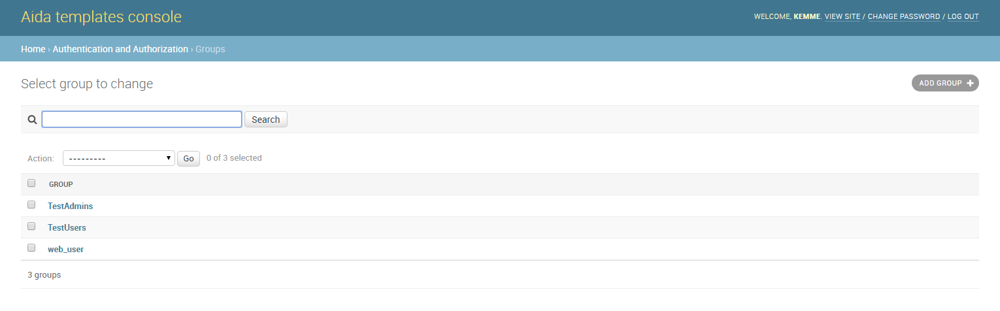
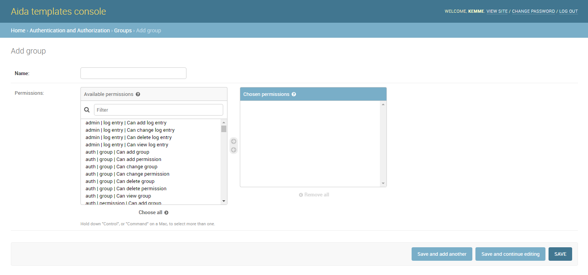
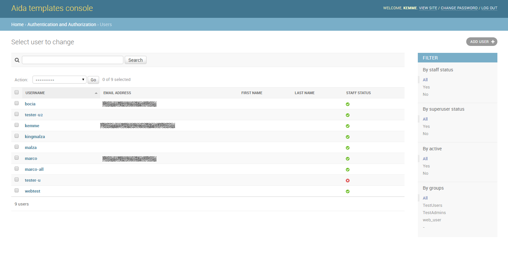
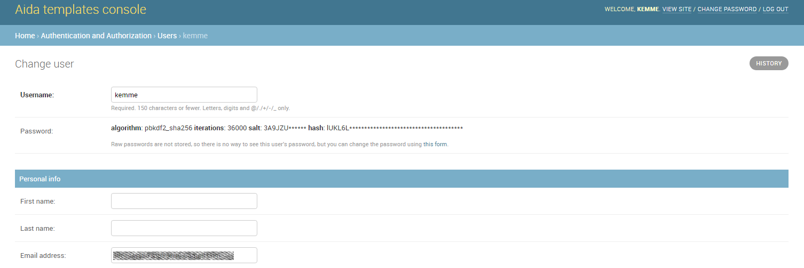
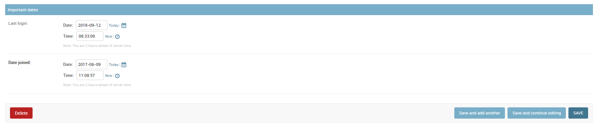

Create user and manage groups
==============

----------------
Create and manage groups
-----------------

In Aida, the group is a grouping of actions that the user associated with that group can perform within the system.
Basically the types of action that can be associated with a group are:

* **View**
* **Add/Edit**
* **Delete**

To define and manage groups in Aida, it is sufficient to use the **Users and Groups-> Group Manager** menu

.. figure:: img/home_user.png
   :scale: 50 %
   :alt: Aida homepage

Once you have access to group management from the main menu, the administration screen will show the list of active groups in the system:
   

Create a new group
-----------------

To create a new group of users is sufficient, from the group management screen just opened select the "ADD GROUP" button, the mask to add a new group will appear:

* **Name** :Name that you want give to the new group (unique)
* **Available permissions** :Permissions that can be provided or denied on the various system tables
* **Chosen permission** :Permits that have been assigned to the group we are creating

.. note::
   Within all Aida administration forms, there are three buttons to confirm the changes you want to make:

   * **Save and add another** :It saves the data entered, and proposes the same cleaned mask in order to quickly perform a new data    entry. (in some masks, once this option is selected, the system will re-propose some pre-filled fields to guarantee insertion speed)
   * **Save and continue editing** :Save the entered data and re-propose the mask with the same data inside the various fields present before the saving
   * **SAVE** :Save the entered data and return to the list of options previous to the current mask.

Manage an existing group
-----------------

To go to manage an existing group, and sufficient, from the main group management page, select the group on which you intend to work, the following screen will appear:

.. figure:: img/group_manage.png
   :scale: 50 %
   :alt: Aida groups
   
The mask is similar to that for adding a new group seen before, with the difference that in the **Chosen permissions** section there are the previously assigned permissions.

.. note::
   In all the editing templates of Aida there is the possibility to see the history of the changes made on the data that are being managed through the use of the ** HISTORY ** button located at the top right.

-----------------
Create and manage user
-----------------

Once the aida group (s) have been defined, it is possible to create one or more users to associate with that group through the **User Management** function from the Aida homescreen.

Create a new user
-----------------

To create a new user in Aida, from the main user management mask, select the ** ADD USER + ** button

.. figure:: img/user_add.png
   :scale: 50 %
   :alt: Aida groups

* **Username**: The username you want to assign to the user you are creating (unique)
* **Password**: The password for the user, must be complied following the indications regarding the requirements listed under this field
* **Password confirmation**: The same password entered previously

Manage an existing user
-----------------

To manage an existing user whether it is a newly created user or a previously configured user, simply select the one you want to manage from the initial user management screen:

   
* **Username**: The selected User username
* **Password**: *Raw passwords are not stored, so there is no way to see this user's password*
* **Personal info**
   * **First name**: The first name of the user (optional)
   * **Last name**: The last name for the user (optional)
   * **Email address**: Email address for the user (used for password remember etc. etc.)

.. figure:: img/user_manage2.png
   :scale: 50 %
   :alt: Aida groups

* **Permissions**
   * **Active**: *Designates whether this user should be treated as active. Unselect this instead of deleting accounts.*
   * **Staff status**: *Designates whether the user can log into this admin site.*
   * **Superuser status**: *Designates that this user has all permissions without explicitly assigning them.*
   * **Groups**: Groups to which the user is associated by inheriting the permissions set
   * **User Permissions**: It is possible to set individual permissions for the specific user outside those set for the group.

* **Important dates**
   * **Last login**: Date and time of the last system login made by the selected user
   * **Date joined**: Date and time when the user was created for the first time
